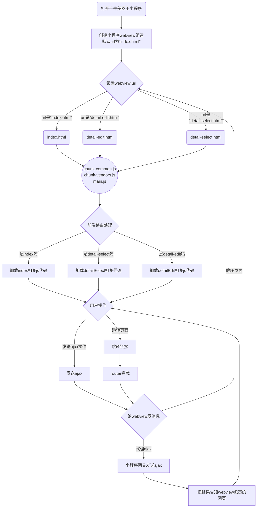
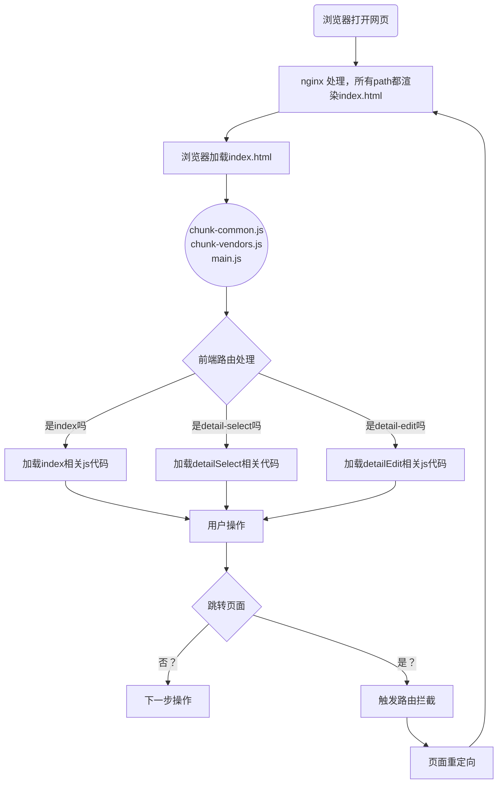
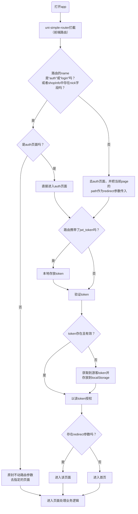
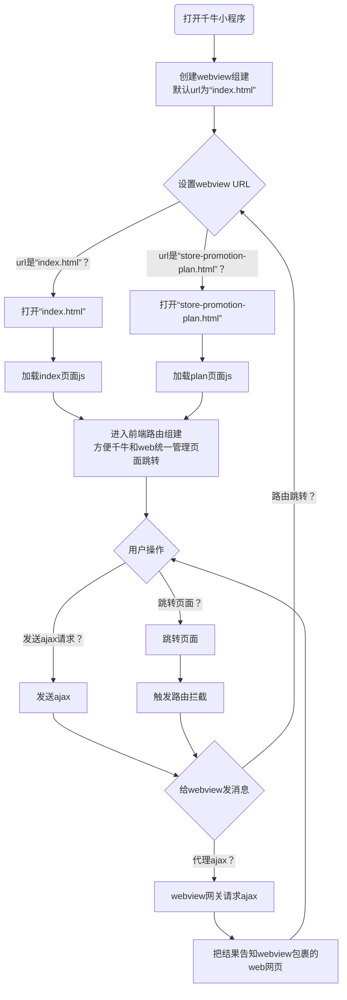
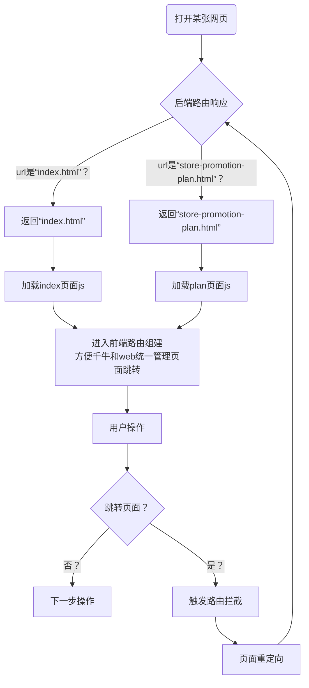

# 前端仓库
---
| 仓库               | 描述                                      |
| ------------------ | ----------------------------------------- |
| MtwInDifferentApps | React版PC美图王（包含千牛、module、优选） |
| ClientPC           | PC客户端                                  |
| MiniMtw            | 新版手机mtw                               |
| Webpage            | Jquery美图王PC版                          |
| WebSite            | 省心快车，省心店长，美图店长              |
| client_phone       | 旧版手机端（美图王和店小美）              |
| mtwlabel           | 有赞主图水印                              |
| PsPlugin           | ps一键抠图插件                            |
| CrmClient          | 美图王crm                                 |


# MtwInDifferentApps
---
该仓库下有4个目录 QianniuProject | 1688DetailProject | 1688Project | devCode  

#### 一. QianniuProject   千牛美图王以及模块化的工程仓库，使用create-react-app创建的  
1. qianniu_mini_app  这个是千牛小程序原生的代码，用来包裹webview的 
2. qianniu_mini_app/webview  这个是千牛webview生产环境代码 
3. module_dist   这个是module.wusetech.com的生产环境的代码 
4. src   这个是软链，source目录是devCode，前端业务逻辑的原始代码 
5. config-overrides.js   这个是create-react-app的配置文件。  
  + qiankun相关的配置 
  
  + 网页注入开发和生产环境的相关变量  
    + APP_NAME  当前APP的名称，目前有MTW（本环境提供）、1688_YOUXUAN_ZHUTU（1688Project环境提供）、 1688_YOUXUAN_DETAIL（1688DetailProject环境提供） 
    + RUN_ENV   代码将要在哪里运行（QIANNIU | BROWSER） 
    + IS_MODULE 代码是否在module.wusetech.com中运行 
    + REMOTE_HOST 后端host（mtw.wusetech.com）  
    
  + module_dist中只有一个入口，index.html。 
  
  + qianniu_mini_app/webview 中每张页面一个入口，index.html | detail-edit.html等，因为千牛webview中想实现多页面，url的path必须和真实的html名称一一对应。在配置文件中是使用CopyHtmlPlugin.js这个自定义webpack插件实现的。  
  
  + package.json  脚本及依赖管理文件  
    + build:qianniu：千牛生产环境代码打包命令，执行该命令会把代码打包进入qianniu_mini_app/webview。 
    + build:browser:module：module.wusetech.com生产环境代码打包命令，执行该命令会把代码打包进module_dist目录。  
    + script 可以设置 RUN_ENV、 APP_NAME、 PROXY_HOST、IS_MODULE等环境变量。

7. qianniu_mini_app/webview代码执行流程


8. module.wusetech.com执行流程

8. 千牛小程序是先在千牛授权成功才能打开webview，所以web页面不需要关心授权问题，但是module.wusetech.com是在浏览器中使用的，作为模块来使用，一般都是在已经授权的页面比如Jquery美图王中打开，所以到达module.wusetech.com，需要url携带参数的形式来授权，`//module.wusetech.com/login?jwt_token=${jwt_token}&redirect=/tag-make-select&referer=${encodeURIComponent(location.origin)}/index`。打开login页面，以传入的token授权，然后重定向到指定页面。

#### 二、 1688DetailProject  1688优选工作台详情页工程目录 
1. .browserslistrc， 该文件必须存在，否则打包会报错。
2. src 这个是软链，source目录是devCode，前端业务逻辑的原始代码。
3. custom.config.js，这个是优选工作台的配置文件：
	+ 可以设置APP_NAME=1688_YOUXUAN_DETAIL、REMOTE_HOST等环境变量。
	+ symlinks设置为false，表示使用软链作为路径。
	+ dll，所有npm安装的包放在这里，打包缓存加快构建速度。
	+ archive.js，这个是自己写的nodejs文件，作用就是在上传packagexxx.zip时，把devCode复制一份，并重命名src替换工程目录下的src软链。因为云构建时使用的是package[xxx].zip，需要真实的目录，不能识别软链。
	+ scripts：
		+ start:zhangjm，开发时使用。需要绑定host <font color="red">127.0.0.1 localhost 127.0.0.1 g.alicdn.com</font>
		+ archive，打包并生成package[xxx].zip包

#### 三、 1688Project  1688优选工作台主图工程目录 
主体和1688DetailProject一样，但是custom.config.js中APP_NAME=1688_YOUXUAN_ZHUTU。

#### 四、devCode 前端开发业务代码
这里存放着前端的业务代码，router、api等模块在export时，会根据APP_NAME、RUN_ENV来区分不同的环境导出该模块在该环境所用到的真实的依赖。


# ClientPC
---
#### 一、该仓库中存放着多个客户端代码
+ dxm_client
+ mtdz_client
+ pddCpm_client
+ sxdz_client

#### 二、每个目录代码分离，不共用，主要就是package.json里的几个命令
+ npm run dev开发环境启动命令
+ npm run build生产环境代码执行命令，会生成对应的exe程序包


# MiniMtw
---
该仓库存放着新版手机美图王的代码，里面的miniapp是工程根目录，该工程目录是使用vue-cli创建的uni-app项目。目前该工程支持打包h5和微信小程序，ali小程序需要后期适配。

+ H5打开时都是在H5的体系下操作。
+ 微信小程序打开时，除了详情页的编辑页面和主图制作的编辑页面外，都是在小程序的体系下操作，两个编辑页面是利用小程序提供的webview组建，内嵌H5页面来实现操作。

#### 一、App前端工作流程


#### 二、vue.config.js 项目的一些配置
+ 向页面注入了ROUTES、PAGES_JSON全局变量，在src里的js中可以直接获取到该变量
+ CopyWebpackPlugin 会在H5编译时，把public/static/js目录下的内容复制到[UNI_PLATFORM]/static/js下，因为webview中想要获取小程序提供的部分api，需要加载小程序的sdk，并且uni-app sdk也要加载，方便使用uni提供的方法使用该api。public/static/js/uni.webview.1.5.2.js即uni-app的sdk。
+ 设置uni.scss中的变量为全局scss变量，可以在vue单文件的style中使用该变量，不需要再单独引入。

#### 三、src/styles/uniconfont.js
这是自己写的js，方便把iconfont的样式，转换成uni-app跨平台的样式文件，操作方式如下：
+ 在iconfont官网切换到Font class模式
+ 下载文件到本地，命名为download.zip
+ 用node执行uniconfont.js即可得到跨平台样式文件iconfont.scss

#### 四、需要使用webview sdk的页面可以在pages里该页面的onLoad生命周期，手动加载对应平台需要的sdk文件。

#### 五、小程序打开详情页和主题制作的编辑页面的逻辑如下（以详情页编辑为例子）：
+ 进入detail-edit-webview页面
+ 创建webview组建，url为 `https//m.wusetech.com/#/pages/auth/auth/?jwt_token=${token}&redirect=/pages/detail-edit/detail-edit?id=${id}`，token就是小程序授权的jwt_token，id是详情页模板id。
+ webview进入auth页面授权，然后重定向到detail-edit页面。

#### 六、VUE_APP_MTW_HOST
这个环境变量是用来只想后端host用的，在不同环境有不同作用：
+ H5 dev下，用来作为代理服务器的target使用，让localhost下发送的请求被代理到后端服务器解决跨域问题。
+ H5 prd和小程序环境下，作为ajax真实的host使用，后端需要允许对当前域名跨域cores处理。
+ 所有ajax返回的结果中存放在后端服务器的静态资源如`static/image_store`等格式的文件路径都会被加上VUE_APP_MTW_HOST变成`[mtw|zhanghj].wusetech.com/static/image_store`这种格式。


# Webpage
---
这是前后端不分离的项目，前端采用JQuery编写的，html集成在Django的templates下，作为后端的view启动。因为引入了webpack，所以是把前端准备好的符合python渲染模版语法的多页面html打包进template目录下。前端文件主要存放在以下几个目录
+ client，使用webpack打包的前端文件，包含各页面html、css、js、assets文件。
+ static，存放静态文件，因为有些js、image不需要打包，直接在html中引入。有的静态文件可能是在其他app中使用的，这时候，static完全是作为cdn使用。
+ templates，该目录下存在以下几个子目录：
	+ dev，美图王开发环境的html，在执行npm run dev 时会被webpack编译的html文件覆盖。<strong><font color="red">不要直接修改改文件</font></strong>
	+ prd，线上运行的生产环境的代码，在执行npm run prd 时会被webpack编译的html文件覆盖。<strong><font color="red">不要直接修改改文件</font></strong>
	+ mtw，这个是mtw.wusetech.com加载的推广页，如果要修改，直接修改该目录下的文件。
	+ qn_dev和qn_prd，这个是以前做的h5内嵌千牛手机客户端的代码，已经不用了。

#### 一、client工程介绍
config/common_maco_vatiate.js，该文件是导出mako模板语法的字符串，在html中引入，方便公用变量的引入，不然每个html都要单独设置，太麻烦。具体是在config/webpack.base.config.js中替换html模板中的特定字符串实现的。

loader/css-replace-loader，这是一个webpack loader，主要就是在生产环境中，把css文件中的static/images字符串加上//staticcommprd.wusetech.com前缀，实现cdn加速，因为css文件中引入的静态资源可能是client工程外static目录下的，webpack无法处理publicPath。

plugins/html-replace-webpack-plugin.js，主要是在webpack打包时对src/html下的文件内容进行处理：
+ 替换html中“@@commonMacoVariate”字符串为mako变量。
+ 往html中插入“/static/lib/sentry-5.15.4.min.js”。
+ 在html中script标签加入“crossorigin="anonymous"，便于收集脚本error。
+ 在生产环境html中“static/images”、“static/lib”静态资源加上“//staticcommprd.wusetech.com”前缀，实现cdn加速。

webpack.base.config.js是webpack打包公用的配置，webpack.dev.config.js是开发环境用的配置，webpack.prd.config.js是生产环境用的配置。

webpack.entry.js里面配置了每个页面html依赖的js文件和css文件，没新加一张页面都应该在该文件下加一行配置。

#### 二、package.json中scripts含义
+ rmmap 删除js的map文件，防止生产环境可以看到源吗
+ dev 运行开发环境
+ prd 运行生产环境
+ cdn 手动同步静态文件到cdn


# WebSite
---
这是一个前后端分离项目，前端代码在WebSite/shengx/static目录下，可以独立出来。整个项目是多页面应用。

#### 一、config目录，webpack相关的配置脚本。
common目录存放了一些工具函数，供webpack使用。

entry/entryBuild.js 创建入口文件使用的工具函数，生成类似react单页应用中index.js的文件，会自动插入RouterWrapper，不需要每个页面再手动引入。

entries目录存放的是千牛和web各自有哪些页面，因为两个环境所展示的页面不尽相同，可以在各自的环境下优化js、css文件体积。

userInfos/userInfos.js，配置的是开发着的开发环境的前端端口和后端端口，比如前端端口8004，后端端口7004。

views/views.js，配置的是前端开发环境的多页面view配置，供webpack devServer historyApiFallback使用。

webpack目录是webpack config设置，符合webpack文档的描述。
1. webpack.base.conf.js中向web运行时导入了2个环境变量`RELEASE_VERSION`和`RUN_ENV`：
+ RELEASE_VERSION，该变量是给sentry上传时，定义app的name和版本号用的。
+ RUN_ENV，该变量表示当前程序运行的环境，目前有qianniu或undefined，为undefined即表示运行在浏览器中。
2. webpack.com.conf.js中给html的title加上了"省心快车"的前缀，并且当运行环境是千牛时，引入了千牛webview的sdk。
3. webpack.devBuildHtml.conf.js，该文件在开发环境中，引入了webpack devServer中的script。
4. webpack.dev.conf.js，开发环境的配置，符合官方文档的字段。
5. webpack.entry.conf.js，根据config/entry目录中的配置自动生成入口文件。
6. webpack.file.conf.js，定义了一些webpack常量，比如千牛的生产环境文件打包目录，非千牛生产环境的文件打包目录。
7. webpack.prod.conf.js，生产环境目录，sentry引用时需要在webpack中做的配置应该在该目录下配置，之前由于千牛环境不支持sentry，所以临时注释了相关配置，后面要开启可以把注释放开，但是要注意区分下运行环境。

package.json文件中定义依赖和相关脚本的执行命令，开发环境是在浏览器模式执行的，只需要执行npm run dev:xxx相关的命令，生产环境执行npm run build:xxx相关的命令，其他命令为内部命令，不需要使用。

#### 二、app 目录存放的是前端开发的源代码。

#### 三、整个项目执行的流程。
1. 千牛环境和美图王千牛小程序结构类似。


3. web环境。


# client_phone
---
这是旧版的美图王手机端仓库：
+ 包含微信小程序、H5、安卓App、阿里卖家小程序4个平台
+ 包含美图王、店小美2个应用。

该仓库是用Hbuilder创建的，不是用vue-cli创建的，所有编辑运行都要使用Hbuilder IDE。区分4个平台可以使用uni-app内置的UNI_PLATFORM区分，2个应用是使用自定义的PLATFORM实现的，具体配置在package.json中新增uni-app字段：
```json
{
  "uni-app": {
    "scripts": {
      "aligjz-mtw": {
        "title": "美图王阿里国际站小程序",
        "env": {
          "UNI_PLATFORM": "mp-alipay",
          "APP_NAME": "MTW"
        },
        "define": {
          "MP-ALIPAY-1688-MTW": true,
          "MP-ALIPAY": true
        }
      },
      "mp-weixin-mtw": {
        "title": "美图王微信小程序",
        "env": {
          "UNI_PLATFORM": "mp-weixin",
          "APP_NAME": "MTW"
        },
        "define": {
          "MP-WEIXIN-MTW": true,
          "MP-WEIXIN": true
        }
      },
      "mp-weixin-dxm": {
        "title": "店小美微信小程序",
        "env": {
          "UNI_PLATFORM": "mp-weixin",
          "APP_NAME": "DXM"
        },
        "define": {
          "MP-WEIXIN-DXM": true,
          "MP-WEIXIN": true
        }
      },
      "h5-mtw": {
        "title": "美图王H5",
        "BROWSER": "Chrome",
        "env": {
          "UNI_PLATFORM": "h5",
          "APP_NAME": "MTW"
        },
        "define": {
          "H5-MTW": true,
          "H5": true
        }
      },
      "h5-dxm": {
        "title": "店小美H5",
        "BROWSER": "Chrome",
        "env": {
          "UNI_PLATFORM": "h5",
          "APP_NAME": "DXM"
        },
        "define": {
          "H5-DXM": true,
          "H5": true
        }
      }
    }
  }}
```

比如要判断当前平台是h5端的店小美，可以使用以下判断：
```javascript
// #ifdef h5-dxm
code...
// #endif
```

#### 一、app-plus.env文件
由于一套代码实现多个安卓app的生成，而不同app有不同的APP_NAME不同，所以当要开发美图王时，把APP_NAME设置为“MTW”，开发店小美时设置为“DXM”。

#### 二、dxm_manifest.json、mtw_manifest.json、app_setting.js。
由于app打包依赖manifest.json文件，而由于不同应用所依赖的配置不同，所以预先配置了两个配置文件dxm_manifest.json和mtw_manifest.json，当要切换应用时，先设置好app-plus.env中的环境变量，然后执行`node app_setting.js`即可自动把对应应用的配置导入到manifest.json中。

#### 三、.env.dev、env.prd.js
设置开发环境和生产环境中的变量
+ VUE_APP_REMOTE_HOST：微信小程序、H6、安卓app下，发送ajax时指定的host。阿里卖家小程序走的是小程序网关
+ VUE_APP_CDN_HOST：由于阿里卖家限制了外网资源的host，但是可以使用阿里oss上的资源，所以，采用了这个字段，配置不同环境下图片等资源的host。其他平台依然可以使用“staticcommprd.wusetech.com”或“mtw.wusetech.com”这种host。
+ VUE_APP_ALI_CLOUD_APP_ID：这是是阿里卖家小程序不同环境下的cloud_id的配置，用来初始化cloud的。
+ VUE_APP_USER_NAME：保留字段，暂时没用到。

#### 四、prd-tar目录、.tar.sh、tar.js
H5端发布上线的流程是：
+ 后端在client_phone仓库下找到prd-tar目录，找到对应应用的.tar压缩包。
+ 解压出对应压缩包的内容到指定位置。

所以，为了简化过程，当Hbuilder打包生成了h5资源后，使用.tar.sh会自动的把h5目录打包成.tar.gz格式并存放到prd-tar目录。为什么会有个tar.js文件？由于window平台不支持.sh脚本，所以用node写了个跨平台的脚本，做的事和.tar.sh相同。执行的命令是
```bash
node tar.js [dxm | mtw]
```

#### 五、vue.config.js
这是正常的vue环境的工程化配置文件，可以在里面做些修改，适配打包。

#### 六、其他目录以及文件都是正常的前端代码文件，使用的是vue框架。
router采用的也是uni-simple-router这个uni-app跨平台路由库。具体使用方式可以参照官方文档，这里使用的是1.0版本。

#### 七、README.md
该文件记录了安卓app的包名，证书名，以及注册证书的相关信息。证书文件存放在mtw开发机/etc/android目录下。

# mtwlabel
---
这个是有赞主图水印的代码，环境是有赞官方提供的，根目录是后端运行环境，采用nodejs编写的，web框架用的是egg.js，这些都是有赞官方的默认配置。

同时该仓库复用了代码，发布到微盟主图水印使用。

#### 一、node web相关配置
+ app/controller 目录下新增了mtwbq.js文件，作用就是渲染生产环境的view。
+ app/router.js 中设置路由规则，匹配controller方法。
+ config/config.default.js 中增加了以下代码
```javascript
config.security = {
    xframe: {
		enable: false
    },
};
```
关闭**X-Frame-Options**验证，否则页面无法在有赞控制台展示。

#### 二、mtwlabel-ui/react-app-use-page
这个是前端的文件位置，看名字就知道这个工程使用的是react框架编写的。以下都是围绕这个目录说明。

#### 三、youzanConfig.json、weimengConfig.json
这两个文件看名字就能判断是有赞和微盟两个平台的配置文件，里面字段如下：
+ appName：定义appname。
+ configDir:  暂时未用到。
+ devOutputDir：开发环境代码打包的位置。
+ prodOutputDir：生产环境代码打包的位置。

#### 四、cdn目录，.cdn.json
cdn目录下存放着静态文件，目前存放的是webassembly，package.json中有一条命令，"youzanyun:upload"，会把cdn目录中的文件上传到有赞云并把返回的cdn地址写入.cdn.json文件，该命令实际上执行的是webpack/upload.js脚本。

在生产环境下，代码生成的vendor、main等js、css包都会被上传到有赞云的cdn，并写入到生成的html中，这些都是webpack实现的。

#### 五、package.json
1. 环境变量设置：
+ DEVELOPER：指定开发者，比如我的开发环境后端host是zhangjm.wusetech.com，那我就设置DEVELOPER为zhangjm。
+ APP_PLATFORM：区分有赞和微盟使用的。

2. scripts命令：
+ youzan:dev:xxx：开发环境运行命令。
+ youzan:build：生产环境运行命令。执行完该命令后会在当前目录生成 dist或weimeng-dist目录，里面存放的是生产环境代码，有赞平台下，直接git推送到有赞的git仓库，微盟下，推送到mtw的git仓库。

# PsPlugin
---
ps一键抠图插件的仓库


# CrmClient 
---
美图王crm仓库