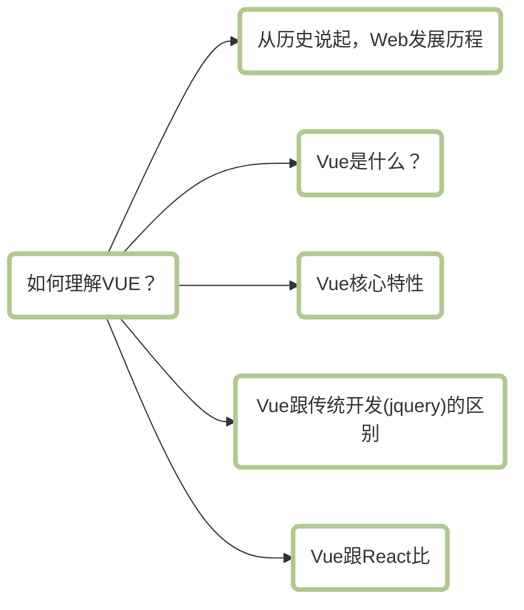
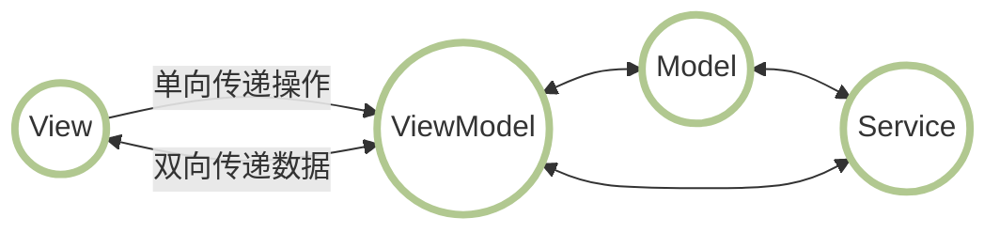
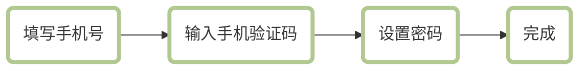
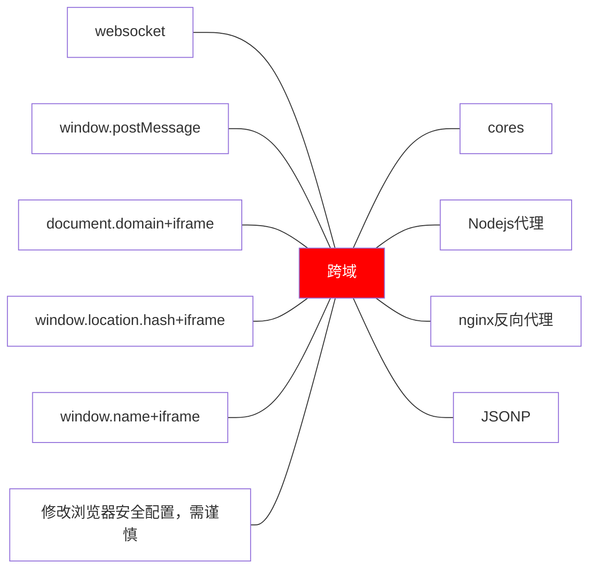
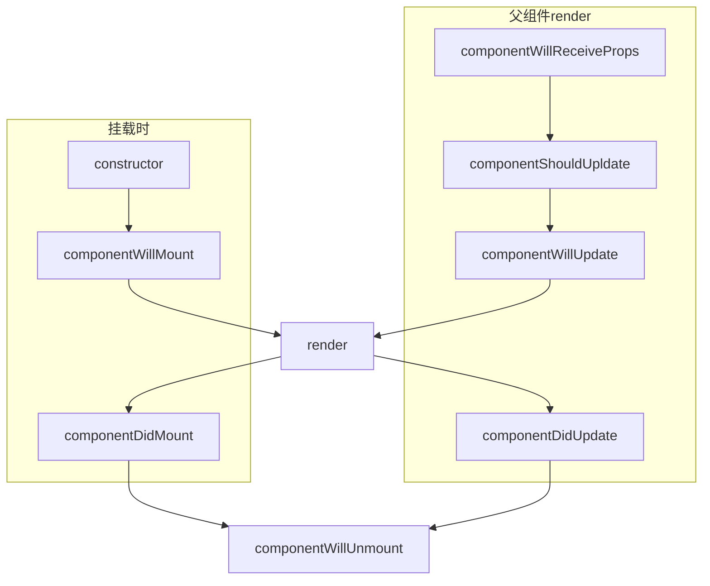
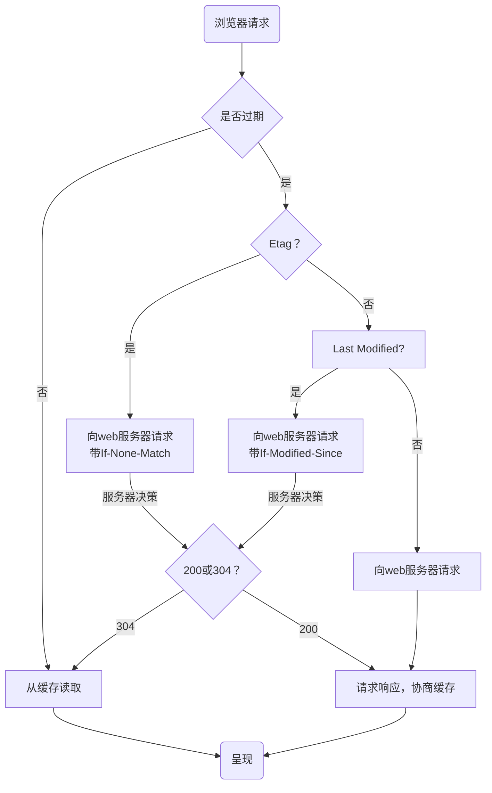

## for in、Object.keys、Object.hasOwnPropertyName、Reflect.ownKeys之间的区别
1. for in：
+ 遍历对象和其原型链上的可枚举属性。
+ 遍历数组时，除遍历其元素外，还会遍历开发着对数组对象自定义的和数组原型链上的可枚举属性。
+ 遍历对象返回的属性名和遍历数组返回的索引都是string类型。
+ 某些情况下，可能按随机顺序遍历数组。

2. Object.keys：
+ 返回对象自身可枚举属性组成的数组。
+ 不会遍历对象原型链上的属性以及Symbol属性。
+ 对数组的遍历顺序和for in一样。

3. Object.getOwnPropertyNames：
返回一个由指定对象所有自身属性（包含不可枚举属性但不包含Symbol作为属性名的属性）组成的数组

4. Relect.ownKeys返回对象自身属性名（包含不可枚举属性和Symbol作为属性名的属性）组成的数组。等同于Object.getOwnPropertyNames + Object.getOwnPropertySymbols。


## 判断数组
1. `[] instanceof Array`
2. `Object.prototype.toString.call([]) === Array`
3. `Array.isArray([])`
4. `Array.prototype.isPrototypeOf([])`
5. `Object.getPrototypeOf([]) === Array.prototype`
6. `[].constructor === Array

## 如何理解Vue


#### 一、web发展历史
Web是World Wide Web的简称，中文译为万维网

我们可以将它规划成如下的几个时代来进行理解
+ 石器时代
+ 文明时代
+ 工业革命时代
+ 百花齐放时代

###### 石器时代指的就是我们的静态网页
最早的网页是没有数据库的，可以理解成就是一张可以在网络上浏览的报纸，直到CGI技术的出现，通过CGI Perl运行一小段代码与数据库或文件系统进行交互，如当时的Google（1998）年。

###### 文明时代
2005年左右，先后出现了ASP、JSP技术，增强了web与服务端交互的安全性。JSP其实就是Java + HTML。

JSP又一个缺点，就是不太灵活，因为JSP是在服务端执行的，返回的就是一段HTML文本，我们每次的请求（获取的数据、内容的加载），都是服务器为我们返回渲染之后的DOM，这也就使我们开发网站的灵活度大打折扣。

在这种情况下，同年Ajax火了。

###### 工业革命时代
到这里大家就熟悉了。

移动设备的普及，jquery的出现，以及SPA的雏形，Angularjs这样一批前端框架随之出现，但当时SPA的路不好走，例如SEO问题，SPA过多的页面，复杂场景下View的绑定等，都没有很好的处理。

这几年的飞速发展，节约了开发人员大量的精力，降低了开发着和开发过程的门槛，极大提升了开发效率和迭代速度，我们可以称之为工业时代。

###### 百花齐放时代
Vue、React、Angular等等。

#### 二、Vue是什么
Vue是一个用于创建用户界面的开源Javascript框架，也是一个创建单页应用的Web应用框架，同时也是一款流行的Javascript前端框架，旨在更好地组织与简化Web开发。Vue所关注的核心是MVC中的视图层，同时，他也能方便地获取数据更新，并通过组建内部特定的方法实现视图与模型的交互。

#### 三、Vue的核心特性
###### 数据驱动（MVVM）
MVVM表示的是Model-View-ViewModel
+ Model：模型层，负责处理业务逻辑以及和服务器端进行交互
+ View：视图层，负责将数据模型转化为UI展示出来，可以简单的理解为HTML
+ ViewModel：视图模型层，用来连接Model和View，是Model和View之间的通信桥梁


###### 组件化
1. 什么是组件化？
一句话来说就是把图形、非图形的各种逻辑均抽象为一个统一的概念（组件）来实现开发的模式。在Vue中每一个`.vue`文件都可以视为一个组件。

2. 组件化的优势
+ 降低整个系统的耦合度，在保持接口不变的情况下，我们可以替换不同的组件快速完成需求。例如输入框，可以替换为日历、时间、范围等组件作具体的实现。

+ 调试方便，整个系统是通过组建组合起来的，在出现问题的时候，可以用排除法直接移除组件，或者根据报错的组件快速定位问题，之所以能够快速定位，是因为每个组建之间低耦合，职责单一，所以逻辑会比分析整个系统简单。

+ 提高可维护性，由于每个组件的职责单一，并且组件在系统中是被复用的，所以对代码进行优化可获得系统的整体升级。

###### 指令系统
解释：指令是带有`v-`前缀的特殊属性
作用：当表达式的值改变时，将其产生的连带影响，响应式的作用于DOM。

常用的指令：
+ 条件渲染指令`v-if`
+ 列表渲染指令`v-for`
+ 属性绑定指令`v-bind`
+ 事件绑定指令`v-on`
+ 双向数据绑定指令`v-model`

#### 四、Vue跟传统开发的区别
没有落地使用场景的革命不是好革命，就以一个高频的应用场景来示意吧

注册账号这个需求大家应该很熟悉了，如下：


用jquery来实现大概的思路就是选择流程DOM对象，点击按钮隐藏当前活动流程DOM对象，显示下一流程DOM对象。

用Vue来实现，我们知道Vue基本不操作DOM节点，双向绑定使DOM节点跟视图绑定后，通过修改变量的值控制DOM节点的各类属性。

总结就是：
+ Vue的所有界面事件，都是只去操作数据的，jquery操作DOM。
+ Vue的所有界面的变动，都是根据数据自动绑定出来的，jquery操作DOM。

#### 五、Vue和React对比
这里就做几个简单的类比吧，当然没有好坏之分，只是使用场景不同。

相同点：
+ 都有组件化思想
+ 都支持服务端渲染
+ 都有Virtual DOM（虚拟DOM）
+ 数据驱动视图
+ 都有支持native的方案：Vue的weex，React的React native
+ 都有自己的构建工具，Vue的Vue-cli，React的Create React App

区别：
+ 数据变化的实现原理不同，react使用的是不可变数据，而Vue使用的是可变的数据
+ 组件化通信的不同，react中我们通过使用回调函数来进行通信的，而Vue中子组件向父组件传递消息有两种方式：事件和回调函数。
+ diff算法不同，react主要使用diff队列保存需要更新哪些DOM，得到patch树，再统一操作批量更新DOM，Vue使用双向指针，边对比边更新DOM。

## 使用float布局容易产生什么问题，解决方式呢？
+ 子元素在设置float后，会脱离文档流，造成父元素高度塌陷

解决方式：
+ 父元素设置高度
+ 清除浮动

## HTTPS是什么？
HTTPS即加密的HTTP，HTTPS并不是一个新协议，而是HTTP+SSL（TLS）。原本HTTP先和TCP（假定传输层是TCP协议）直接通信，而加了SSL后，就变成了HTTP先和SSL通信，再由SSL和TCP通信，相当于SSL被嵌在了HTTP和TCP之间。

## 介绍几种常见的状态码
2XX系列：代表请求已经成功被服务器接收、理解并接受。

200：表示请求已经成功，请求所希望的响应头或数据体将随此响应返回

201：表示请求成功并且服务器创建了新的资源，且其URI已经随Location返回

3XX系列：代表需要客户端采取进一步的操作才能完成请求，这些状态码用来重定向，后续的请求地址在本次响应的Location域中指明。

301：被请求的资源已永久移动到新位置

302：请求的资源临时从不同的URI响应请求

304：自动上次请求后，请求的网页未修改过，服务器返回此响应时，不会返回网页内容。

4xx系列：表示请求错误，代表了客户端看起来可能发生了错误，妨碍了服务器的处理

401：请求要求身份验证，对于需要登录的网页，服务器可能返回此响应

403：服务器已经理解请求，但拒绝执行他，与401响应不同的是，身份验证并不能提供任何帮助，而且这个请求也不应该被重复提交。

404：请求失败，请求所希望得到的资源未被在服务器上发现

5xx系列：代表了服务器在处理请求的过程中有错误或者异常状态发生，也有可能是服务器意识到以当前的软硬件资源无法完成对请求的处理。

500：服务器遇到了一个未曾预料的情况，导致了他无法完成对请求的处理

503：由于临时的服务器维护或过载，服务器当前无法处理请求


## 闭包是什么？
闭包就是能够读取其他函数内部变量的函数

## NaN是什么？
表示`Not a Number`  
typeof NaN == 'number'

## 谈谈你对webpack的理解
是一个对资源进行模块化和打包的工具，处理每个模块的import和export。

## 说一下深拷贝和浅拷贝及常用实现方式
+ 浅拷贝：以赋值的形式拷贝引用对象，仍指向同一个引用地址，修改时原对象也会受到影响。

实现方式：Object.assign，展开运算符。

+ 深拷贝：完全拷贝一个新对象，修改时原对象不再受到任何影响。

实现方式：JSON.parse(JSON.stringify)，递归遍历

## 使用JSON自带函数进行深拷贝有什么问题？
+ 具有循环引用的对象时，报错。
+ 当值为函数或undfined时，无法拷贝。

## 跨域问题如何解决？
同源策略：浏览器安全策略，同协议、ip、端口的脚本才会执行。


## Cores
跨域请求分为简单请求和复杂请求
### 一、简单请求需满足以下所有条件：
1. 请求方法必须是GET、POST、HEAD中的一种，其他方法不行。
2. 请求头类型只能是Accept、Accept- Language、Content- Language、Content-Type，添加其他额外请求头不行。
3. 请求头Content-Type如果有，值只能是text/plain、multipart/form-data、application/x-www-form-urlencoded中的一种，其他值不行。
4. 请求中的任意XMLHttpRequestUpload对象均没有注册任何事件监听器。
5. 请求中没有使用ReadableStream对象。

### 二、复杂请求即除简单请求外的请求。

### 三、CORES常使用的响应头
+ Access-Control-Allow-Origin：指示请求的资源能共享给哪些域，可以是具体的域名或*（表示所有域）。
+ Access-Control-Allow-Credentials：指示当请求的标记为true时，是否响应该请求。
+ Access-Control-Allow-Headers：用在对预请求的响应中，指示实际的请求中可以使用哪些http头。
+ Access-Control-Allow-Methods：用在对预请求的响应中，指示实际的请求中允许哪些http方法。
+ Access-Control-Expose-Headers：指示哪些http头的名称能在响应中列出。
+ Access-Control-Max-Age：指示预请求的结果能被缓存多久。
+ 

### 四、CORES最常使用的请求头为
+ Orign：指示获取资源的请求是从什么域发起的。
+ Access-Control-Request-Headers：用于发起一个预请求，告知服务器正式请求会使用哪些HTTP头。
+ Access-Control-Request-Method：用于发起一个预请求，告知服务器正式请求会使用哪一种HTTP请求方法。


## js判断变量是否为整数？
```javascript
function isInteger(data) {
	return typeof data === 'number' && data % 1 === data;
}

function isInteger(data) {
	return Number.isInteger(data);
}
```

## 进程和线程是什么？
线程是最小的执行单元，而进程由至少一个线程组成。如何调度进程和线程，完全由操作系统决定，程序自己不能决定什么时候执行，执行多长时间。

进程指计算机中已运行的程序

线程指操作系统能够进行运算调度的最小单位。

## 死锁是什么？
当两个以上的运行单元，双方都在等待对方停止运行，以获取系统资源，但是没有一方提前退出时，就称为死锁。

## xhr的readyState取值。
+ 0：还未创建请求，即未调用open方法。
+ 1：已调用open方法，但未发送send方法。
+ 2：已调用send方法，但未收到响应。
+ 3：已收到部分响应。
+ 4：已收到全部响应。

## React旧版生命周期


## React新版生命周期


## __proto__和prototype的区别
1. prototype是构造函数的属性，指向属于该构造函数的原型对象。
2. \__proto\__是任何对象的属性，指向该对象构造函数的原型对象。

## 继承的六种实现方式
### 一、原型链继承
```javascript
function Person(name, age) {
  this.name = name;
  this.age = age;
}
Person.prototype.setAge = function() {
  console.log('111');
}

function Student(price) {
  this.price = price;
}
Student.prototype = new Person();
Student.prototype.sayHello = function() {};
```

优点：
1. 简单、易于实现。
2. 父类原型原型方法/原型属性，子类都能访问到。

缺点：
1. 无法实现多继承。
2. 来自原型对象的所有属性被所有实例共享。
3. 创建子类实例时，无法向父类构造函数传惨。
4. 想要为子类新增属性或方法，必须放到`Student.prototype = new Person();`之后，不能放到构造器中。

### 二、借用构造函数继承
```javascript
function Person(name, age) {
  this.name = name;
  this.age = age;
}
Person.prototype.setAge = function() {
  console.log('111');
}

function Student(name, age, price) {
  Person.call(this, name, age);
  this.price = price;
}

Student.prototype.sayHello = function() {};
```

优点：
1. 解决了原型链继承中子类共享父类引用属性的问题。
2. 创建子类实例时可以向父类传递参数。
3. 可以实现多继承（call多个父类对象）。

缺点：
1. 实例并不是父类的实例，只是子类的实例。
2. 只能继承父类的实例属性和方法，不能继承原型属性和方法。
3. 无法实现函数复用，每个字类都有父类实例函数的副本，影响性能。

### 三、原型链+借用构造函数的组合继承
```javascript
function Person(name, age) {
  this.name = name;
  this.age = age;
}
Person.prototype.setAge = function() {
  console.log('111');
}

function Student(name, age, price) {
  Person.call(this, name, age);
  this.price = price;
}

Student.prototype = new Person();
Student.prototype.constructor = Student;
Student.prototype.sayHello = function() {};
```

优点：
1. 可以继承实例属性和方法，也可以继承原型属性和方法
2. 不存在引用属性共享问题。
3. 可传惨。
4. 函数可复用。

缺点：
1. 调用了两次父类构造函数，生成了2份实例。

### 四、组合继承优化1
```javascript
function Person(name, age) {
  this.name = name;
  this.age = age;
}
Person.prototype.setAge = function() {
  console.log('111');
}

function Student(name, age, price) {
  Person.call(this, name, age);
  this.price = price;
}

Student.prototype = Person.prototype;
Student.prototype.sayHello = function() {};
```

优点：
1. 不会实例化两次实例方法/属性，避免组合继承的缺点。

缺点：
1. 没办法辨别实例是子类还是父类构造的，子类和父类的构造函数指向同一个。

### 五、组合继承优化2
```javascript
function Person(name, age) {
  this.name = name;
  this.age = age;
}
Person.prototype.setAge = function() {
  console.log('111');
}

function Student(name, age, price) {
  Person.call(this, name, age);
  this.price = price;
}

Student.prototype = Object.create(Person.prototype);
Student.prototype.construtor = Student;
Student.prototype.sayHello = function() {};
```

### 六、ES6中class继承
```javascript
class Person{
  constructor(name, age) {
    this.name = name;
    this.age = age;
  }
  setAge() {
    console.log('111');
  }
}

class Student extends Person{
  constructor(name, age, price) {
    super(name, age);
    this.price = price;
  }

  sayHello() {}
}
```

优点：
1. 语法简单易懂，操作更方便

缺点：
1. 不是所有的浏览器都支持。

## 从URL输入到页面展现经历了什么？


+ DNS解析：将域名解析成IP地址
+ TCP连接：TCP三次握手
+ 发送HTTP请求
+ 服务端处理请求并返回HTTP报文
+ 浏览器解析渲染页面
+ 断开连接，TCP四次挥手

### 一、TCP三次握手的过程如下：
+ 客户端发送一个SYN=1、Seq=x的数据包到服务端端口
+ 服务端发送一个SYN=1、ACK=X+1、Seq=Y的数据包以示传达确认信息。
+ 客户端再回传一个ACK=Y+1、Seq=Z的数据包，代表“握手结束”。

### 二、浏览器渲染页面


## HTTP缓存
HTTP缓存主要是通过请求和响应报文头中的对应headers信息，来控制缓存的策略。
响应头中相关字段为 Expires、Cache-Control、Last-Modified、Etag。


## https和http
### 一、区别
1. https需要ca证书
2. http是超文本传输协议，信息是明文传输，https是具有安全性的ssl加密传输协议
3. 使用不用的链接方式，端口也不同，一般来说，http使用80端口，https使用443端口。
4. http是无状态的，https是由ssl+http协议构建的可进行加密传输、身份认证的网络协议，比http安全。

### 二、https协议工作原理。
1. 客户端使用https url访问服务器，要求web服务器建立ssl链接。
2. web服务器接收到客户端的请求之后，会将网站的证书（证书包含公钥）传输给客户端。
3. 客户端和web服务开始协商ssl的安全等级，也就是加密等级。
4. 客户端通过双方协商一致的安全等级，建立会话密钥，然后通过网站的公钥来加密会话密钥，然后传送给网站。
5. web服务端通过自己的私钥解密会话密钥。
6. web服务端通过会话密钥加密与客户端之间的通信。

## ES6新特性
1. 块级作用域、块级变量let、块级常量const
2. 箭头函数
3. 参数处理，默认参数、rest剩余变量
4. 模板字符串
5. 对象的扩展
	+ 创建对象时可以简化重名的方法和键值对
	+ 属性名可以用表达式
1. 解构赋值
2.  模块（import/export）
3. 类（class/extends）
4. Promise、async/await

## 箭头函数和普通函数的区别
1. 语法更加简洁、清晰
2. 箭头函数不会创建自己的this，它会捕获自己在定义时所处的外层执行环境的this。
3. 箭头函数继承而来的this指向永远不会变
4. call、apply、bind无法改变箭头函数中的this指向。
5. 箭头函数不能作为构造函数使用。
6. 箭头函数没有自己的arguments。
7. 箭头函数没有原型prototype。
8. 箭头函数不能用作generator函数，不能使用yield关键字。

## HTML表示列表的元素
```html
<!-- 无序列表 -->
<ul>
	<li></li>
</url>

<!-- 有序列表 -->
<ol>
	<li></li>
</ol>

<!-- 自定义列表 -->
<dl>
	<dt></dt>
	<dd></dd>
</dl>
```

## HTML表示引用的标签
```html
<q></q>
<bloackquote></bloackquote>
```

## word-wrap、word-break
1. word-wrap指示是否允许单词内换行
2. word-break标明单词内换行的方式。

## font-virant
把字母转成小型大写字母

## text-transform
+ capitalize：首字母大写
+ upercase：转成大写
+ lowercase：转成小写

## XSS攻击
### 一、存储型XSS的攻击步骤
1. 攻击者将恶意代码提交到目标网站的数据库中。
2. 用户打开目标网站时，网站服务端将恶意代码从数据库取出，拼接在 HTML 中返回给浏览器。
3. 用户浏览器接收到响应后解析执行，混在其中的恶意代码也被执行。
4. 恶意代码窃取用户数据并发送到攻击者的网站，或者冒充用户的行为，调用目标网站接口执行攻击者指定的操作。

这种攻击常见于带有用户保存数据的网站功能，如论坛发帖、商品评论、用户私信等。

### 二、反射型
1. 攻击者构造出特殊的 URL，其中包含恶意代码。
2. 用户打开带有恶意代码的 URL 时，网站服务端将恶意代码从 URL 中取出，拼接在 HTML 中返回给浏览器。
3. 用户浏览器接收到响应后解析执行，混在其中的恶意代码也被执行。
4. 恶意代码窃取用户数据并发送到攻击者的网站，或者冒充用户的行为，调用目标网站接口执行攻击者指定的操作。

反射型 XSS 跟存储型 XSS 的区别是：存储型 XSS 的恶意代码存在数据库里，反射型 XSS 的恶意代码存在 URL 里。

反射型 XSS 漏洞常见于通过 URL 传递参数的功能，如网站搜索、跳转等。

由于需要用户主动打开恶意的 URL 才能生效，攻击者往往会结合多种手段诱导用户点击。

POST 的内容也可以触发反射型 XSS，只不过其触发条件比较苛刻（需要构造表单提交页面，并引导用户点击），所以非常少见。

### 三、DOM型
1. 攻击者构造出特殊的 URL，其中包含恶意代码。
2. 用户打开带有恶意代码的 URL。
3. 用户浏览器接收到响应后解析执行，前端 JavaScript 取出 URL 中的恶意代码并执行。
4. 恶意代码窃取用户数据并发送到攻击者的网站，或者冒充用户的行为，调用目标网站接口执行攻击者指定的操作。

DOM 型 XSS 跟前两种 XSS 的区别：DOM 型 XSS 攻击中，取出和执行恶意代码由浏览器端完成，属于前端 JavaScript 自身的安全漏洞，而其他两种 XSS 都属于服务端的安全漏洞。

## CSS继承
### 一、文本相关的属性
color/font-/text-/ line开头的属性会被继承。

### 二、列表相关的属性
list-style-image、list-style-position、list-style-type、list-style。
